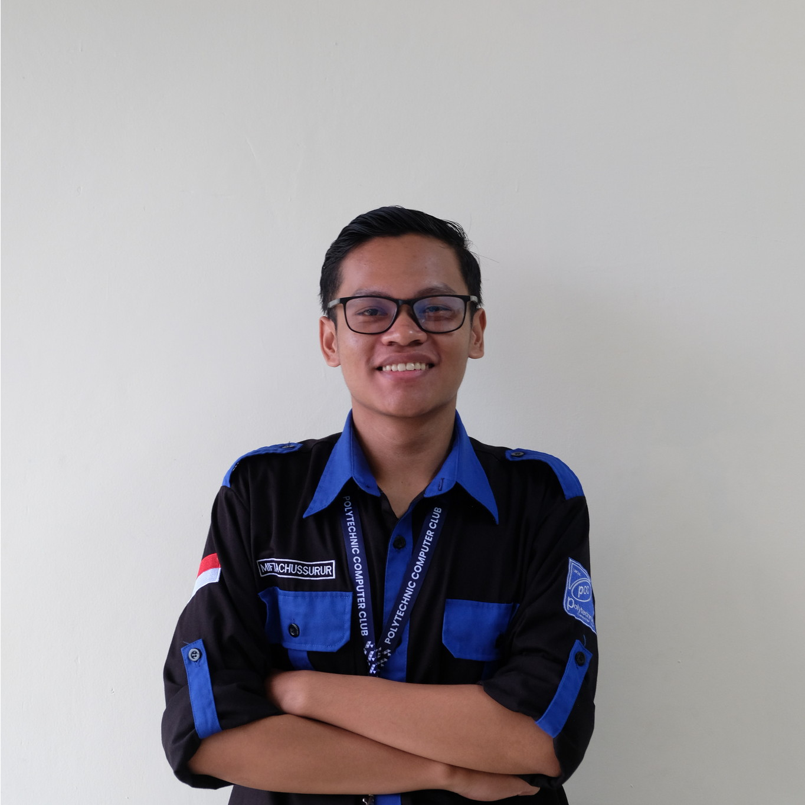

# Miftachussurur's Portfolio

A modern, responsive, and animated personal portfolio website built with the latest web technologies. This project showcases my skills, experience, and projects as an Undergraduate Computer Engineering Student.

 
*(Note: Replace this with a screenshot of your actual landing page)*

## 🚀 Tech Stack

*   **Framework:** [Next.js 16](https://nextjs.org/) (App Router)
*   **Styling:** [Tailwind CSS v4](https://tailwindcss.com/)
*   **Animations:** [Framer Motion](https://www.framer.com/motion/)
*   **Language:** [TypeScript](https://www.typescriptlang.org/)
*   **Deployment:** [Vercel](https://vercel.com) (Recommended)

## ✨ Features

*   **Modern UI/UX:** Clean, professional design with a custom color palette (Indigo, Emerald, Rose, Amber, Sky Blue).
*   **Responsive Design:** Fully optimized for mobile, tablet, and desktop screens.
*   **Dark Mode Support:** Automatically adapts to system color scheme preferences.
*   **Smooth Animations:** Engaging entrance animations and interactive hover effects.
*   **Dynamic Components:**
    *   **Hero Section:** Welcoming introduction with a glowing profile photo.
    *   **Skills Grid:** Categorized display of technical proficiencies.
    *   **Timeline:** Visual history of professional experience and organizational leadership.
    *   **Project Gallery:** Interactive grid with modal details for deeper insights.

## 🛠️ Getting Started

First, install the dependencies:

```bash
npm install
# or
yarn install
# or
pnpm install
```

Then, run the development server:

```bash
npm run dev
# or
yarn dev
# or
pnpm dev
```

Open [http://localhost:3000](http://localhost:3000) with your browser to see the result.

## 📁 Project Structure

*   `app/page.tsx`: Main entry point for the landing page.
*   `app/components/`: Reusable UI components (Hero, Skills, Timeline, Gallery).
*   `app/data/portfolio.ts`: Centralized data file for easy content updates.
*   `app/globals.css`: Global styles and Tailwind CSS configuration.
*   `public/`: Static assets (images, icons).

## 🎨 Customization

To personalize this portfolio:

1.  **Update Content:** Edit `app/data/portfolio.ts` with your own information.
2.  **Add Images:** Place your photos in the `public/` directory and update references in the data file.
3.  **Adjust Colors:** Modify the CSS variables in `app/globals.css` to change the theme.

## 📄 License

This project is open source and available under the [MIT License](LICENSE).